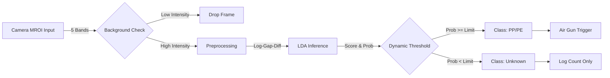

# System Architecture - HyperSort

## 1. System Overview
**HyperSort** (Project FlashHSI) is a high-speed hyperspectral sorting system targeting **Black Plastics**.
- **Performance Target**: 700 FPS / < 1.4ms Latency
- **Robustness**: Lighting Variation Handling via Physics-based Preprocessing.

### 1.1. Workflow
- **Offline (Python)**: Raw Data Collection $\rightarrow$ SPA Band Selection $\rightarrow$ LDA Training $\rightarrow$ `model.json`.
- **Online (C# WPF)**: Load `model.json` $\rightarrow$ Receive MROI (5 Bands) $\rightarrow$ Log-Gap-Diff Preprocessing $\rightarrow$ LDA Inference $\rightarrow$ Air Gun Trigger.

## 2. Tech Stack Setup
| Component | Tech | Reason |
|-----------|------|--------|
| **Framework** | .NET 8.0 (C#) | High-performance JIT, Windows Compatibility |
| **UI** | WPF (MaterialDesign) | DirectX rendering, Operator-friendly |
| **Algorithm** | LDA | Minimal computation cost, Robust distribution handling |
| **Preprocessing** | Log-Gap-Diff | Replaces SNV. Cancels lighting scale in MROI context |
| **Optimization** | Unsafe / Pointer | Zero GC, Direct Memory Access |

## 3. Data Processing Pipeline (Runtime)
**Time Budget**: 1.4ms per frame.

### ⚡ Core Algorithm Details

1.  **Safety (Background Check)**
    - Logic: If `Sum(Bands) < 5000` $\rightarrow$ Return Background (Drop).
    - Purpose: Ignore empty conveyor belt areas.

2.  **Preprocessing (Physics-based)**
    - Formula:
      $$ Abs = -\log_{10}(Raw + \epsilon) $$
      $$ Feature = Abs_{Target} - Abs_{Gap} $$
    - Effect: Cancels out multiplicative lighting variations (Scale).

3.  **Inference (LDA)**
    - Score: $\text{DotProduct}(Features, Weights) + Bias$
    - Prob: $\text{Softmax}(Score)$

4.  **Decision**
    - If `MaxProb >= SliderValue` $\rightarrow$ Sort (Action).
    - Else $\rightarrow$ Unknown.
